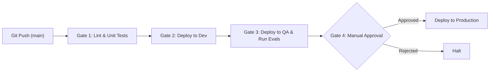

# Enterprise AI Agent CI/CD Pipeline (Azure AI Foundry)

[](.github/workflows/ai-agent-ci-cd.yml)
[](https://pypi.org/project/azure-ai-projects/)
[](https://www.python.org/)

A production-grade, GitOps-driven deployment engine for Azure AI Foundry Agents. 

This repository provides an end-to-end **Infrastructure-as-Code (IaC)** pipeline to manage, version, and deploy AI Agents programmatically. By moving away from manual "Click-Ops" in the Azure Portal, this template ensures deterministic, reproducible, and highly trackable AI deployments across all environments (Dev, QA, Prod).

---

## 🎯 The Problem This Solves

Historically, AI agent configurations (System Prompts, Temperatures, Tool bindings) are manually configured via web UIs. This leads to configuration drift, untracked prompt changes, and the classic *"it works in Dev but hallucinates in Prod"* dilemma.

**Our Architecture Enforces:**
1. **Version Control for AI:** Your `system_prompt.txt` and environment configurations (`config/*.yaml`) live in source control. Every behavior change is tied to a Git commit and code review.
2. **Immutable Versioning:** Leveraging the modern Azure AI Projects v2.0+ SDK (`create_version()`), deployments do not overwrite existing agents. Each pipeline run stamps a new, immutable version (e.g., `v1`, `v2`), enabling instantaneous rollbacks.
3. **Separation of Concerns (Brain vs. Wrapper):** The underlying Large Language Model (e.g., `gpt-4o-mini`) is managed separately as foundational infrastructure. This repository manages the **Agent**—the wrapper containing the personality, tools, and context.
4. **Secretless Authentication:** Utilizes OpenID Connect (OIDC) and `DefaultAzureCredential` for zero-trust CI/CD execution.

---

## 🏗️ Repository Architecture

```text
.
├── .github/workflows/       # CI/CD Pipeline definitions
│   └── ai-agent-ci-cd.yml   # Multi-stage GitHub Actions workflow
├── config/                  # Deterministic environment configurations
│   ├── dev.yaml
│   └── prod.yaml
├── evals/                   # Automated AI quality evaluations
│   └── run_evals.py
├── scripts/                 # Core deployment engine
│   └── deploy_agent.py      # Uses Azure AI SDK to create/update agents
├── src/
│   ├── agent/               
│   │   └── system_prompt.txt # The Agent's core instructions/persona
│   └── tools/               # Custom Python Functions bound to the agent
│       └── system_status.py
├── PREREQUISITES.md         # Infrastructure requirements
└── requirements.txt         # Python dependencies
```

---

## 🚀 CI/CD Pipeline Flow

This repository implements a rigorous 4-Gate deployment strategy:



1. **Lint & Test:** Validates custom Python tools (`src/tools/`) using `pytest` and `flake8`.
2. **Dev Deployment:** Authenticates via OIDC, parses `config/dev.yaml`, and executes `deploy_agent.py` against the Dev Foundry endpoint.
3. **QA & Evaluate:** Deploys to QA and triggers `run_evals.py` to run batch evaluations (e.g., measuring hallucination rates against a strict threshold).
4. **Production Gate:** Pipeline pauses. Requires manual human sign-off via GitHub Environments before pushing the exact same deterministic artifact to Prod.

---

## 🛠️ Phased Deployment Strategy

When building Enterprise AI, do not deploy the model, prompt, and custom tools all at once. We adhere to a strict phased rollout:

### Phase 1: The Barebones Agent (Current Default)
Establish the pipeline, authenticate the service principal, and verify the model connection. In this phase, the agent is deployed with **only** the `model_deployment_name`, `system_prompt`, and `temperature`. 

### Phase 2: Tooling & Knowledge Bases
Once the Phase 1 pipeline is green across all environments, uncomment the `ToolSet` logic in `scripts/deploy_agent.py`. 
- Wrap standard Python functions using `FunctionTool(my_func)`
- Bind Azure AI Search indexes via `AzureAISearchTool`
- Re-run the pipeline to inject capabilities into the Agent safely.

---


## ⚠️ Troubleshooting & Architectural Gotchas

| Error / Symptom | Root Cause & Resolution |
| :--- | :--- |
| **"Resource Not Found" during deployment** | The `model_deployment_name` in your `yaml` config does not exactly match the name of the deployed base model in the Azure Portal, OR the base model hasn't been deployed yet. The agent cannot exist without its brain. |
| **Missing `create_agent` method** | You are referencing outdated v1.0 docs. This repository uses the modern v2.0+ SDK which replaces `create_agent` with `create_version(agent_name, definition=PromptAgentDefinition)`. |
| **`AIProjectClient` Auth Failure** | The old `from_connection_string` method is deprecated. We strictly use `AIProjectClient(endpoint, credential=DefaultAzureCredential())`. Ensure `az login` is active locally, or OIDC is configured in CI. |

---

*Maintained by the Platform Engineering Team. For architectural questions, refer to the internal DevOps playbook.*